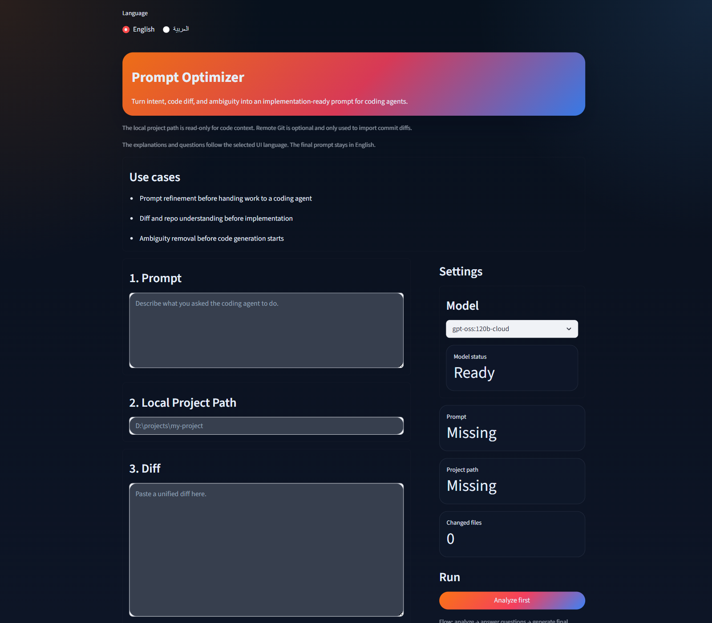
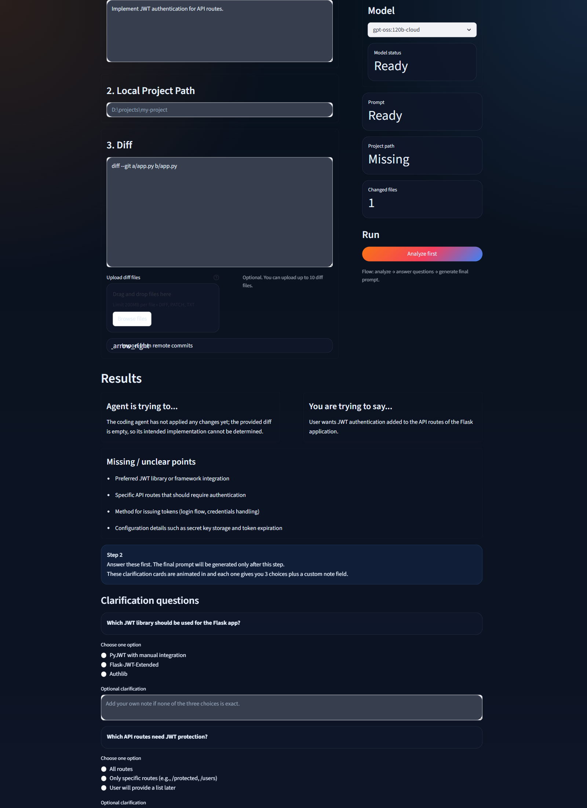
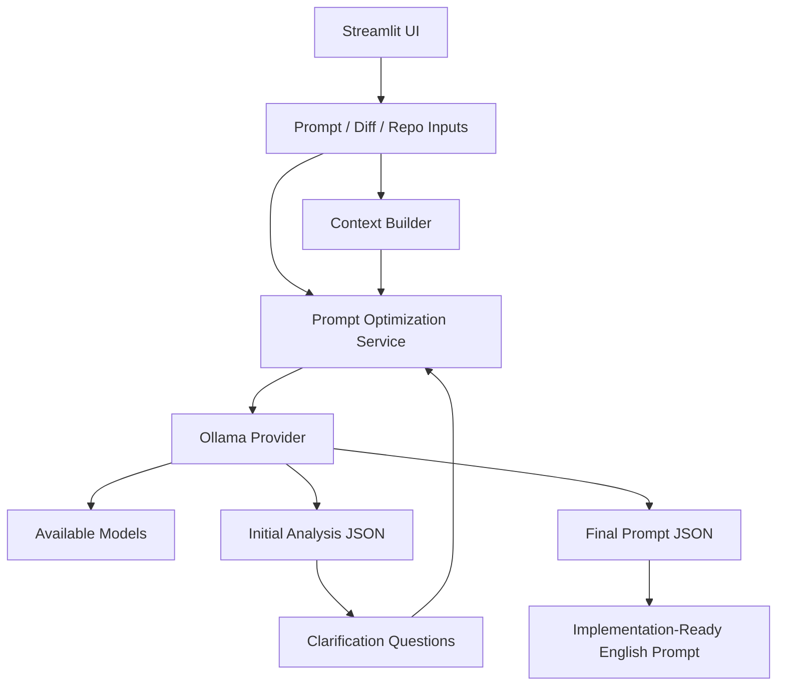

# Prompt Optimizer

Prompt Optimizer turns `intent + code diff + ambiguity` into an implementation-ready prompt for coding agents.  
It analyzes what changed, asks targeted clarification questions, then produces a stronger final prompt in English.




## Who It Is For

- Developers working with coding agents that need better implementation prompts
- Reviewers who want to understand intent from a diff before asking for changes
- Builders who have a rough request, partial code changes, and missing decisions

### You start with

- A rough prompt, task description, or implementation plan
- A unified diff pasted manually, uploaded from a file, or imported from remote commits
- Optional local repository context for changed files

### You get back

- A structured analysis of agent intent vs. user intent
- Clarification questions with three pre-baked options each
- A final implementation-ready English prompt

## What The Product Does

Prompt Optimizer is not a prompt rewriter. It runs a three-stage workflow:

1. Analyze the prompt, diff, and repository context
2. Surface missing decisions as clarification questions
3. Generate a concrete final prompt after answers are provided

### Use cases

- Prompt refinement before handing work to a coding agent
- Diff and repository understanding before implementation
- Ambiguity removal before code generation starts

## Quickstart

### 1. Create and activate a virtual environment

```powershell
python -m venv .venv
.\.venv\Scripts\Activate.ps1
```

### 2. Install dependencies

```powershell
python -m pip install -r requirements.txt
```

### 3. Start Ollama and make sure at least one model is available

The app now lists models from Ollama and lets you choose one in the UI.  
If the preferred model is missing, it automatically falls back to the first available model.

Example:

```powershell
ollama serve
ollama list
ollama pull qwen2.5-coder:7b
```

### 4. Run the app

```powershell
python -m streamlit run diff.py
```

## Example Workflow

### Input

User prompt:

```text
Add JWT authentication for the API routes.
```

Diff:

```diff
diff --git a/app.py b/app.py
index 123..456 100644
--- a/app.py
+++ b/app.py
@@ -1 +1,5 @@
-print("hello")
+def authenticate(token):
+    return token == "secret"
+
+print("hello")
```

### Clarification questions

The app may ask questions such as:

- Which JWT library should be used?
- Which routes need protection?
- How should tokens be issued?
- Where should the secret key and expiry settings live?

Each question comes with three selectable options plus an optional custom note.

### Output

Example final prompt:

```text
Implement JWT authentication for the Flask API routes using Flask-JWT-Extended. Protect only the specified application routes, add a /login endpoint that validates credentials and issues access tokens, load the JWT secret and expiration settings from environment variables, and update any affected tests or route middleware accordingly. If route coverage is still ambiguous, keep the implementation scoped so additional protected routes can be added without refactoring.
```

## Architecture



### Main pieces

- `diff.py`: Streamlit application and UI flow
- `prompt_optimizer/analysis.py`: prompt payload construction and JSON parsing
- `prompt_optimizer/providers.py`: provider boundary plus `OllamaProvider`
- `prompt_optimizer/context.py`: changed-file and related-file context extraction
- `prompt_optimizer/repo_ops.py`: remote commit and diff retrieval
- `prompt_optimizer/preferences.py`: local user preferences stored outside the repo

## Product Notes

- The UI supports English and Arabic explanations, while the final generated prompt stays in English.
- Local preferences such as project path, remote URL, UI language, and selected model are stored in user app data, not in the repository.
- Runtime support in this milestone is Ollama-only, but the code now has a provider boundary for future OpenAI or Anthropic integrations.

## Development

Install dev tools:

```powershell
python -m pip install -r requirements-dev.txt
```

Run the checks used for this milestone:

```powershell
python -m pytest -q
python -m black --check .
python -m ruff check .
python -m mypy prompt_optimizer
```

## Current Scope

- Ollama model selection from the UI
- Automatic fallback to the first available model when the preferred one is missing
- Clear errors for Ollama connectivity issues, empty responses, invalid JSON, and remote Git request failures
- Tests covering provider failures, malformed model output, remote fetch failures, and preferences path behavior
