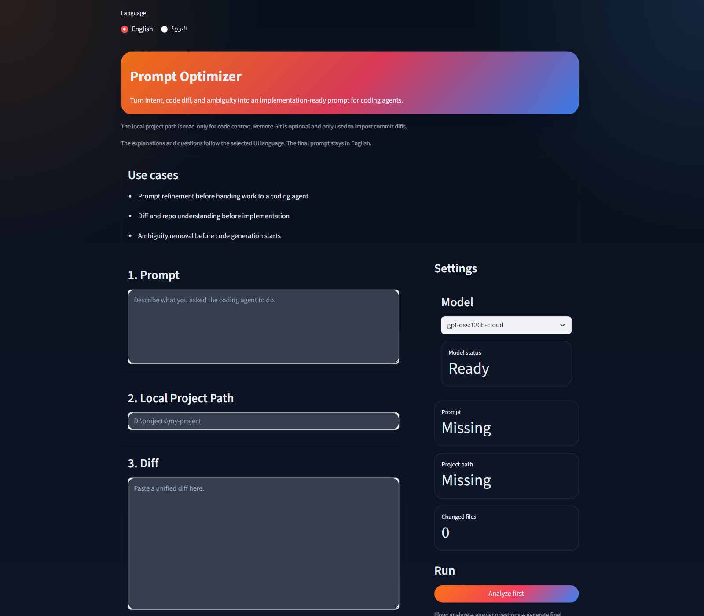
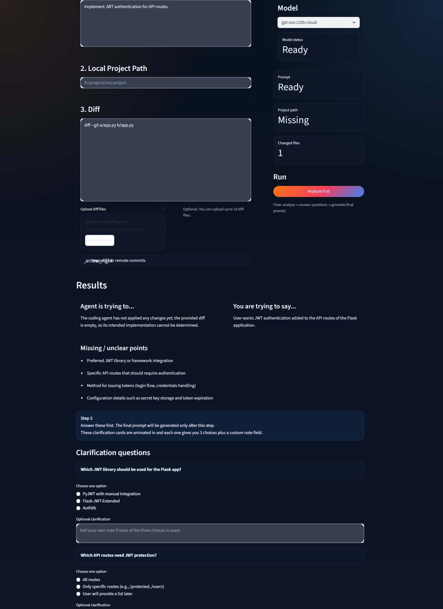
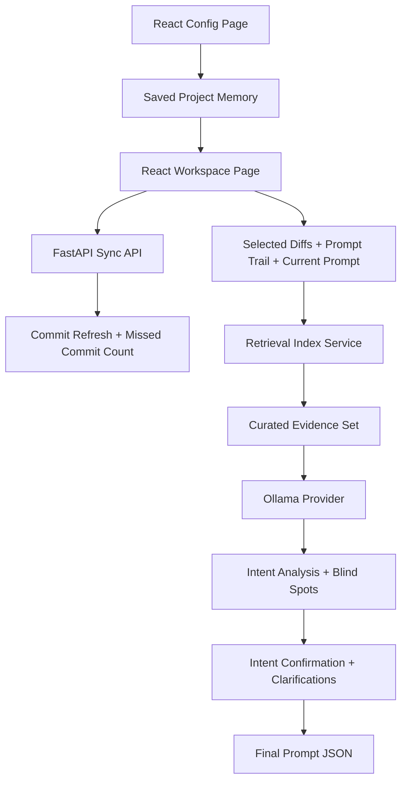

# Prompt Optimizer

Prompt Optimizer turns `intent + code diff + ambiguity` into an implementation-ready prompt for coding agents.  
The app now uses a minimal two-page flow built with FastAPI and React, with internal diff ingestion, project memory, and a hybrid retrieval layer for intent analysis.




## Who It Is For

- Developers working with coding agents that need better implementation prompts
- Reviewers who want to understand intent from a diff before asking for changes
- Builders who have a rough request, partial code changes, and missing decisions

### You start with

- A saved project with a local path and GitHub or GitLab link
- One or more selected commits to inspect
- A current user prompt plus any missing recent prompts required to explain missed commits

### You get back

- A structured analysis of agent intent vs. user intent
- Clarification questions with three pre-baked options each
- A final implementation-ready English prompt

## What The Product Does

Prompt Optimizer is not a prompt rewriter. It runs a three-stage workflow:

1. Refresh remote commits and detect how many commits were missed since the last processed prompt
2. Ingest selected diffs internally, retrieve the most relevant code and prompt evidence, and ask for the matching missing prompts when needed
3. Detect blind spots, confirm the intended user goal, and generate a concrete final prompt only when high-severity gaps are resolved

### Use cases

- Prompt refinement before handing work to a coding agent
- Diff and repository understanding before implementation
- Ambiguity removal before code generation starts

## Quickstart

### 1. Create and activate a virtual environment

```powershell
python -m venv .venv
.\.venv\Scripts\Activate.ps1
```

### 2. Install dependencies

```powershell
python -m pip install -r requirements.txt
```

### 3. Start Ollama and make sure at least one model is available

The app now lists models from Ollama and lets you choose one in the UI.  
If the preferred model is missing, it automatically falls back to the first available model.

Example:

```powershell
ollama serve
ollama list
ollama pull qwen2.5-coder:7b
```

### 4. Start the backend

```powershell
uvicorn prompt_optimizer.api:app --reload
```

### 5. Start the frontend

```powershell
cd frontend
npm install
npm run dev
```

## Example Workflow

### Input

User prompt:

```text
Add JWT authentication for the API routes.
```

Selected diff:

```diff
diff --git a/app.py b/app.py
index 123..456 100644
--- a/app.py
+++ b/app.py
@@ -1 +1,5 @@
-print("hello")
+def authenticate(token):
+    return token == "secret"
+
+print("hello")
```

### Blind spots and clarifications

The app may ask questions such as:

- Which JWT library should be used?
- Which routes need protection?
- How should tokens be issued?
- Where should the secret key and expiry settings live?

High-severity contradictions or missing intent block final prompt generation until the user resolves them.

### Output

Example final prompt:

```text
Implement JWT authentication for the Flask API routes using Flask-JWT-Extended. Protect only the specified application routes, add a /login endpoint that validates credentials and issues access tokens, load the JWT secret and expiration settings from environment variables, and update any affected tests or route middleware accordingly. If route coverage is still ambiguous, keep the implementation scoped so additional protected routes can be added without refactoring.
```

## Architecture


```mermaid
flowchart TD
    A["React Config Page"] --> B["Saved Project Memory"]
    B --> C["React Workspace Page"]
    C --> D["FastAPI Sync API"]
    D --> E["Commit Refresh + Missed Commit Count"]
    C --> F["Selected Diffs + Prompt Trail + Current Prompt"]
    F --> G["Retrieval Index Service"]
    G --> H["Curated Evidence Set"]
    H --> I["Ollama Provider"]
    I --> J["Intent Analysis + Blind Spots"]
    J --> K["Intent Confirmation + Clarifications"]
    K --> L["Final Prompt JSON"]
```

### Main pieces

- `prompt_optimizer/api.py`: FastAPI endpoints for project memory, commit refresh, analysis, and final prompt generation
- `prompt_optimizer/analysis.py`: prompt payload construction and JSON parsing
- `prompt_optimizer/commit_sync_service.py`: commit refresh, missed-commit tracking, and default diff selection
- `prompt_optimizer/retrieval_index_service.py`: internal diff chunking and hybrid retrieval over prompt history, commit metadata, and related code
- `prompt_optimizer/intent_analysis_service.py`: curated evidence assembly for analysis and final prompt generation
- `prompt_optimizer/blind_spot_service.py`: generation gate for high-severity contradictions and ambiguity
- `prompt_optimizer/providers.py`: provider boundary plus `OllamaProvider`
- `prompt_optimizer/context.py`: changed-file and related-file context extraction
- `prompt_optimizer/repo_ops.py`: remote commit and diff retrieval
- `prompt_optimizer/project_memory.py`: persistent multi-project memory, prompt history, and commit-gap logic
- `frontend/`: React client with a config page and workspace page

## Product Notes

- The UI supports English and Arabic explanations, while the final generated prompt stays in English.
- Local preferences and saved projects are stored in user app data, not in the repository.
- Runtime support in this milestone is Ollama-only, but the code now has a provider boundary for future OpenAI or Anthropic integrations.

## Development

Install dev tools:

```powershell
python -m pip install -r requirements-dev.txt
```

Run the checks used for this milestone:

```powershell
python -m pytest -q
python -m black --check .
python -m ruff check .
python -m mypy prompt_optimizer
```

## Current Scope

- Ollama model selection from the UI
- Persistent project memory by local path
- Automatic commit refresh and missed-commit counting
- Internal diff ingestion with commit-subject selection and optional full diff preview
- Hybrid retrieval over prompt history, commit metadata, diff chunks, and changed/related code
- Blind-spot detection that can block final generation until the intent is clear
- Prompt-trail compaction for older missed prompts while keeping the current user prompt intact
- Automatic fallback to the first available model when the preferred one is missing
- Clear errors for Ollama connectivity issues, empty responses, invalid JSON, and remote Git request failures
- Tests covering provider failures, malformed model output, remote fetch failures, and preferences path behavior
